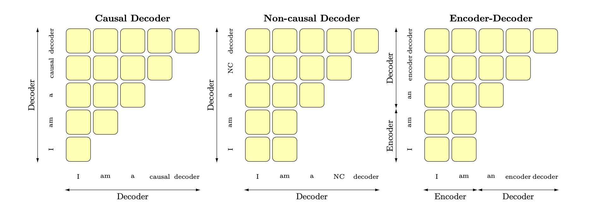

# 1.llm概念

\[toc]

### 1.目前 主流的开源模型体系 有哪些？

目前主流的开源LLM（语言模型）模型体系包括以下几个：

1. **GPT（Generative Pre-trained Transformer）系列**：由OpenAI发布的一系列基于Transformer架构的语言模型，包括GPT、GPT-2、GPT-3等。GPT模型通过在大规模无标签文本上进行预训练，然后在特定任务上进行微调，具有很强的生成能力和语言理解能力。
2. **BERT（Bidirectional Encoder Representations from Transformers）**：由Google发布的一种基于Transformer架构的双向预训练语言模型。BERT模型通过在大规模无标签文本上进行预训练，然后在下游任务上进行微调，具有强大的语言理解能力和表征能力。
3. **XLNet**：由CMU和Google Brain发布的一种基于Transformer架构的自回归预训练语言模型。XLNet模型通过自回归方式预训练，可以建模全局依赖关系，具有更好的语言建模能力和生成能力。
4. **RoBERTa**：由Facebook发布的一种基于Transformer架构的预训练语言模型。RoBERTa模型在BERT的基础上进行了改进，通过更大规模的数据和更长的训练时间，取得了更好的性能。
5. **T5（Text-to-Text Transfer Transformer）**：由Google发布的一种基于Transformer架构的多任务预训练语言模型。T5模型通过在大规模数据集上进行预训练，可以用于多种自然语言处理任务，如文本分类、机器翻译、问答等。

这些模型在自然语言处理领域取得了显著的成果，并被广泛应用于各种任务和应用中。

### 2.prefix LM 和 causal LM 区别是什么？

Prefix LM（前缀语言模型）和Causal LM（因果语言模型）是两种不同类型的语言模型，它们的区别在于生成文本的方式和训练目标。

#### 2.1 Prefix LM

Prefix LM其实是Encoder-Decoder模型的变体，为什么这样说？解释如下：

1. 在标准的Encoder-Decoder模型中，Encoder和Decoder各自使用一个独立的Transformer
2. 而在Prefix LM，Encoder和Decoder则共享了同一个Transformer结构，在Transformer内部通过Attention Mask机制来实现。

与标准Encoder-Decoder类似，**Prefix LM在Encoder部分采用Auto Encoding (AE-自编码)模式，即前缀序列中任意两个token都相互可见，而Decoder部分采用Auto Regressive  (AR-自回归)模式，即待生成的token可以看到Encoder侧所有token(包括上下文)和Decoder侧已经生成的token，但不能看未来尚未产生的token**。

下面的图很形象地解释了Prefix LM的Attention Mask机制(左)及流转过程(右)。

Prefix LM的代表模型有UniLM、T5、GLM(清华滴\~)

#### 2.2 Causal LM

Causal LM是因果语言模型，目前流行地大多数模型都是这种结构，别无他因，因为GPT系列模型内部结构就是它，还有开源界的LLaMa也是。

Causal LM只涉及到Encoder-Decoder中的Decoder部分，采用Auto Regressive模式，直白地说，就是**根据历史的token来预测下一个token，也是在Attention Mask这里做的手脚**。

参照着Prefix LM，可以看下Causal LM的Attention Mask机制(左)及流转过程(右)。

#### 2.3 总结

1. **Prefix LM**：前缀语言模型是一种生成模型，它在生成每个词时都可以考虑之前的上下文信息。在生成时，前缀语言模型会根据给定的前缀（即部分文本序列）预测下一个可能的词。这种模型可以用于文本生成、机器翻译等任务。
2. **Causal LM**：因果语言模型是一种自回归模型，它只能根据之前的文本生成后续的文本，而不能根据后续的文本生成之前的文本。在训练时，因果语言模型的目标是预测下一个词的概率，给定之前的所有词作为上下文。这种模型可以用于文本生成、语言建模等任务。

总结来说，前缀语言模型可以根据给定的前缀生成后续的文本，而因果语言模型只能根据之前的文本生成后续的文本。它们的训练目标和生成方式略有不同，适用于不同的任务和应用场景。

### 3.大模型LLM的 训练目标

大型语言模型（Large Language Models，LLM）的训练目标通常是**最大似然估计（Maximum Likelihood Estimation，MLE）**。最大似然估计是一种统计方法，用于从给定数据中估计概率模型的参数。

在LLM的训练过程中，使用的数据通常是大量的文本语料库。训练目标是**最大化模型生成训练数据中观察到的文本序列的概率**。具体来说，对于每个文本序列，模型根据前面的上下文生成下一个词的条件概率分布，并通过最大化生成的词序列的概率来优化模型参数。

为了最大化似然函数，可以使用梯度下降等优化算法来更新模型参数，使得模型生成的文本序列的概率逐步提高。在训练过程中，通常会使用批量训练（batch training）的方法，通过每次处理一小批数据样本来进行参数更新。

### 4.涌现能力是啥原因？

[大语言模型的涌现能力：现象与解释 - 知乎 (zhihu.com)](https://zhuanlan.zhihu.com/p/621438653 "大语言模型的涌现能力：现象与解释 - 知乎 (zhihu.com)")

涌现能力（Emergent Ability）是指**模型在训练过程中能够生成出令人惊喜、创造性和新颖的内容或行为**。这种能力使得模型能够超出其训练数据所提供的内容，并产生出具有创造性和独特性的输出。

涌现能力的产生可以归因于以下几个原因：

1. **任务的评价指标不够平滑**：因为很多任务的评价指标不够平滑，导致我们现在看到的涌现现象。如果评价指标要求很严格，要求一字不错才算对，那么Emoji\_movie任务我们就会看到涌现现象的出现。但是，如果我们把问题形式换成多选题，就是给出几个候选答案，让LLM选，那么随着模型不断增大，任务效果在持续稳定变好，但涌现现象消失，如上图图右所示。这说明评价指标不够平滑，起码是一部分任务看到涌现现象的原因。
2. **复杂任务** **vs** **子任务**：展现出涌现现象的任务有一个共性，就是任务往往是由多个子任务构成的复杂任务。也就是说，最终任务过于复杂，如果仔细分析，可以看出它由多个子任务构成，这时候，子任务效果往往随着模型增大，符合 Scaling Law，而最终任务则体现为涌现现象。
3. **用** **Grokking** （顿悟）**来解释涌现**：对于某个任务T，尽管我们看到的预训练数据总量是巨大的，但是与T相关的训练数据其实数量很少。当我们推大模型规模的时候，往往会伴随着增加预训练数据的数据量操作，这样，当模型规模达到某个点的时候，与任务T相关的数据量，突然就达到了最小要求临界点，于是我们就看到了这个任务产生了Grokking现象。

尽管涌现能力为模型带来了创造性和独特性，但也需要注意其生成的内容可能存在偏差、错误或不完整性。因此，在应用和使用涌现能力强的模型时，需要谨慎评估和验证生成的输出，以确保其质量和准确性。

### 5.为何现在的大模型大部分是Decoder only结构

1. **Encoder的低秩问题**：Encoder的双向注意力会存在低秩问题，这可能会削弱模型表达能力，就生成任务而言，引入双向注意力并无实质好处。
2. **更好的Zero-Shot性能、更适合于大语料自监督学习**：decoder-only 模型在没有任何 tuning 数据的情况下、zero-shot 表现最好，而 encoder-decoder 则需要在一定量的标注数据上做 multitask finetuning 才能激发最佳性能。
3. **效率问题**：decoder-only支持一直复用KV-Cache，对多轮对话更友好，因为每个Token的表示之和它之前的输入有关，而encoder-decoder和PrefixLM就难以做到。

### 6.大模型架构介绍

Transformer 模型一开始是用来做 seq2seq 任务的，所以它包含 Encoder 和 Decoder 两个部分；他们两者的区别主要是，**Encoder 在抽取序列中某一个词的特征时能够看到整个序列中所有的信息，即上文和下文同时看到**；而 **Decoder 中因为有 mask 机制的存在，使得它在编码某一个词的特征时只能看到自身和它之前的文本信息**。

首先概述几种主要的架构:&#x20;

- 以BERT为代表的**encoder-only**
- 以T5和BART为代表的**encoder-decoder**
- 以GPT为代表的**decoder-only**，
- 以UNILM9为代表的PrefixLM(相比于GPT只改了attention mask，前缀部分是双向，后面要生成的部分是单向的causal mask%)&#x20;

### 6.LLMs复读机问题

#### 6.1 什么是 LLMs 复读机问题？

LLMs复读机问题（LLMs Parroting Problem）是指大型语言模型在生成文本时过度依赖输入文本的复制，而缺乏创造性和独特性。当面对一个问题或指令时，模型可能会简单地复制输入文本的一部分或全部内容，并将其作为生成的输出，而不是提供有意义或新颖的回应。

#### 6.2 为什么会出现 LLMs 复读机问题？

1. **数据偏差**：大型语言模型通常是通过预训练阶段使用大规模无标签数据进行训练的。如果训练数据中存在大量的重复文本或者某些特定的句子或短语出现频率较高，模型在生成文本时可能会倾向于复制这些常见的模式。
2. **训练目标的限制**：大型语言模型的训练通常是基于自监督学习的方法，通过预测下一个词或掩盖词来学习语言模型。这样的训练目标可能使得模型更倾向于生成与输入相似的文本，导致复读机问题的出现。
3. **缺乏多样性的训练数据**：虽然大型语言模型可以处理大规模的数据，但如果训练数据中缺乏多样性的语言表达和语境，模型可能无法学习到足够的多样性和创造性，导致复读机问题的出现。
4. **模型结构和参数设置**：大型语言模型的结构和参数设置也可能对复读机问题产生影响。例如，模型的注意力机制和生成策略可能导致模型更倾向于复制输入的文本。

#### 6.3 如何缓解 LLMs 复读机问题？

为了缓解LLMs复读机问题，可以尝试以下方法：

1. **多样性训练数据**：在训练阶段，使用多样性的语料库来训练模型，避免数据偏差和重复文本的问题。这可以包括从不同领域、不同来源和不同风格的文本中获取数据。
2. **引入噪声**：在生成文本时，引入一些随机性或噪声，例如通过采样不同的词或短语，或者引入随机的变换操作，以增加生成文本的多样性。这可以通过在生成过程中对模型的输出进行采样或添加随机性来实现。
3. **温度参数调整**：温度参数是用来控制生成文本的多样性的一个参数。通过调整温度参数的值，可以控制生成文本的独创性和多样性。较高的温度值会增加随机性，从而减少复读机问题的出现。
4. **Beam搜索调整**：在生成文本时，可以调整Beam搜索算法的参数。Beam搜索是一种常用的生成策略，它在生成过程中维护了一个候选序列的集合。通过调整Beam大小和搜索宽度，可以控制生成文本的多样性和创造性。
5. **后处理和过滤**：对生成的文本进行后处理和过滤，去除重复的句子或短语，以提高生成文本的质量和多样性。可以使用文本相似度计算方法或规则来检测和去除重复的文本。
6. **人工干预和控制**：对于关键任务或敏感场景，可以引入人工干预和控制机制，对生成的文本进行审查和筛选，确保生成结果的准确性和多样性。

需要注意的是，缓解LLMs复读机问题是一个复杂的任务，没有一种通用的解决方案。不同的方法可能适用于不同的场景和任务，需要根据具体情况进行选择和调整。此外，解决复读机问题还需要综合考虑数据、训练目标、模型架构和生成策略等多个因素，需要进一步的研究和实践来提高大型语言模型的生成文本多样性和创造性。

### 7.LLMs输入句子长度理论上可以无限长吗？

**理论上来说，LLMs（大型语言模型）可以处理任意长度的输入句子，但实际上存在一些限制和挑战**。下面是一些相关的考虑因素：

1. **计算资源**：生成长句子需要更多的计算资源，包括内存和计算时间。由于LLMs通常是基于神经网络的模型，计算长句子可能会导致内存不足或计算时间过长的问题。
2. **模型训练和推理**：训练和推理长句子可能会面临一些挑战。在训练阶段，处理长句子可能会导致梯度消失或梯度爆炸的问题，影响模型的收敛性和训练效果。在推理阶段，生成长句子可能会增加模型的错误率和生成时间。
3. **上下文建模**：LLMs是基于上下文建模的模型，长句子的上下文可能会更加复杂和深层。模型需要能够捕捉长句子中的语义和语法结构，以生成准确和连贯的文本。

### 8.什么情况用Bert模型，什么情况用LLaMA、ChatGLM类大模型，咋选？

选择使用哪种大模型，如Bert、LLaMA或ChatGLM，取决于具体的应用场景和需求。下面是一些指导原则：

1. **Bert模型**：Bert是一种预训练的语言模型，**适用于各种自然语言处理任务**，如文本分类、命名实体识别、语义相似度计算等。如果你的任务是通用的文本处理任务，而不依赖于特定领域的知识或语言风格，Bert模型通常是一个不错的选择。Bert由一个Transformer编码器组成，更适合于NLU相关的任务。
2. **LLaMA模型**：LLaMA（Large Language Model Meta AI）包含从 7B 到 65B 的参数范围，训练使用多达14,000亿tokens语料，具有常识推理、问答、数学推理、代码生成、语言理解等能力。LLaMA由一个Transformer解码器组成。训练预料主要为以英语为主的拉丁语系，不包含中日韩文。所以适合于英文文本生成的任务。
3. **ChatGLM模型**：ChatGLM是一个面向对话生成的语言模型，适用于构建聊天机器人、智能客服等对话系统。如果你的应用场景需要模型能够生成连贯、流畅的对话回复，并且需要处理对话上下文、生成多轮对话等，ChatGLM模型可能是一个较好的选择。ChatGLM的架构为Prefix decoder，训练语料为中英双语，中英文比例为1:1。所以适合于中文和英文文本生成的任务。

在选择模型时，还需要考虑以下因素：

- 数据可用性：不同模型可能需要不同类型和规模的数据进行训练。确保你有足够的数据来训练和微调所选择的模型。
- 计算资源：大模型通常需要更多的计算资源和存储空间。确保你有足够的硬件资源来支持所选择的模型的训练和推理。
- 预训练和微调：大模型通常需要进行预训练和微调才能适应特定任务和领域。了解所选择模型的预训练和微调过程，并确保你有相应的数据和时间来完成这些步骤。

最佳选择取决于具体的应用需求和限制条件。在做出决策之前，建议先进行一些实验和评估，以确定哪种模型最适合你的应用场景。

### 9.各个专业领域是否需要各自的大模型来服务？

各个专业领域通常需要各自的大模型来服务，原因如下：

1. **领域特定知识**：不同领域拥有各自特定的知识和术语，需要针对该领域进行训练的大模型才能更好地理解和处理相关文本。例如，在医学领域，需要训练具有医学知识的大模型，以更准确地理解和生成医学文本。
2. **语言风格和惯用语**：各个领域通常有自己独特的语言风格和惯用语，这些特点对于模型的训练和生成都很重要。专门针对某个领域进行训练的大模型可以更好地掌握该领域的语言特点，生成更符合该领域要求的文本。
3. **领域需求的差异**：不同领域对于文本处理的需求也有所差异。例如，金融领域可能更关注数字和统计数据的处理，而法律领域可能更关注法律条款和案例的解析。因此，为了更好地满足不同领域的需求，需要专门针对各个领域进行训练的大模型。
4. **数据稀缺性**：某些领域的数据可能相对较少，无法充分训练通用的大模型。针对特定领域进行训练的大模型可以更好地利用该领域的数据，提高模型的性能和效果。

尽管需要各自的大模型来服务不同领域，但也可以共享一些通用的模型和技术。例如，通用的大模型可以用于处理通用的文本任务，而领域特定的模型可以在通用模型的基础上进行微调和定制，以适应特定领域的需求。这样可以在满足领域需求的同时，减少模型的重复训练和资源消耗。

### 10.如何让大模型处理更长的文本？

要让大模型处理更长的文本，可以考虑以下几个方法：

1. **分块处理**：将长文本分割成较短的片段，然后逐个片段输入模型进行处理。这样可以避免长文本对模型内存和计算资源的压力。在处理分块文本时，可以使用重叠的方式，即将相邻片段的一部分重叠，以保持上下文的连贯性。
2. **层次建模**：通过引入层次结构，将长文本划分为更小的单元。例如，可以将文本分为段落、句子或子句等层次，然后逐层输入模型进行处理。这样可以减少每个单元的长度，提高模型处理长文本的能力。
3. **部分生成**：如果只需要模型生成文本的一部分，而不是整个文本，可以只输入部分文本作为上下文，然后让模型生成所需的部分。例如，输入前一部分文本，让模型生成后续的内容。
4. **注意力机制**：注意力机制可以帮助模型关注输入中的重要部分，可以用于处理长文本时的上下文建模。通过引入注意力机制，模型可以更好地捕捉长文本中的关键信息。
5. **模型结构优化**：通过优化模型结构和参数设置，可以提高模型处理长文本的能力。例如，可以增加模型的层数或参数量，以增加模型的表达能力。还可以使用更高效的模型架构，如Transformer等，以提高长文本的处理效率。

需要注意的是，处理长文本时还需考虑计算资源和时间的限制。较长的文本可能需要更多的内存和计算时间，因此在实际应用中需要根据具体情况进行权衡和调整。
